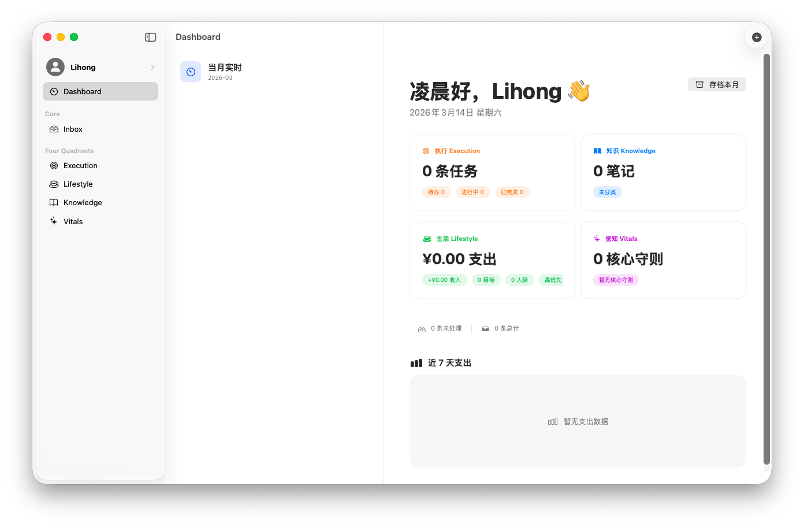
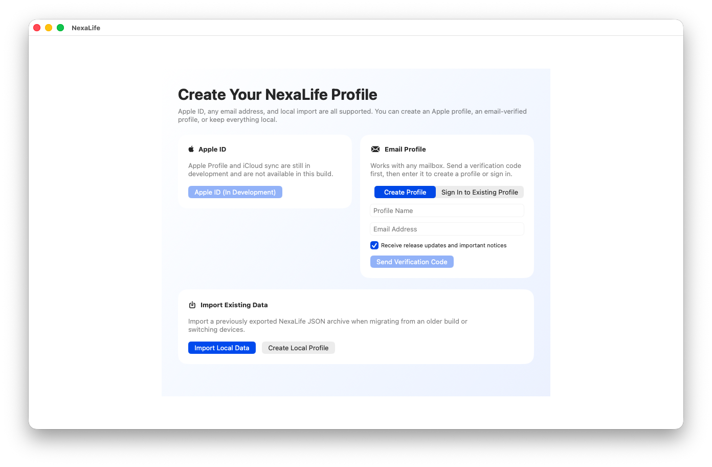
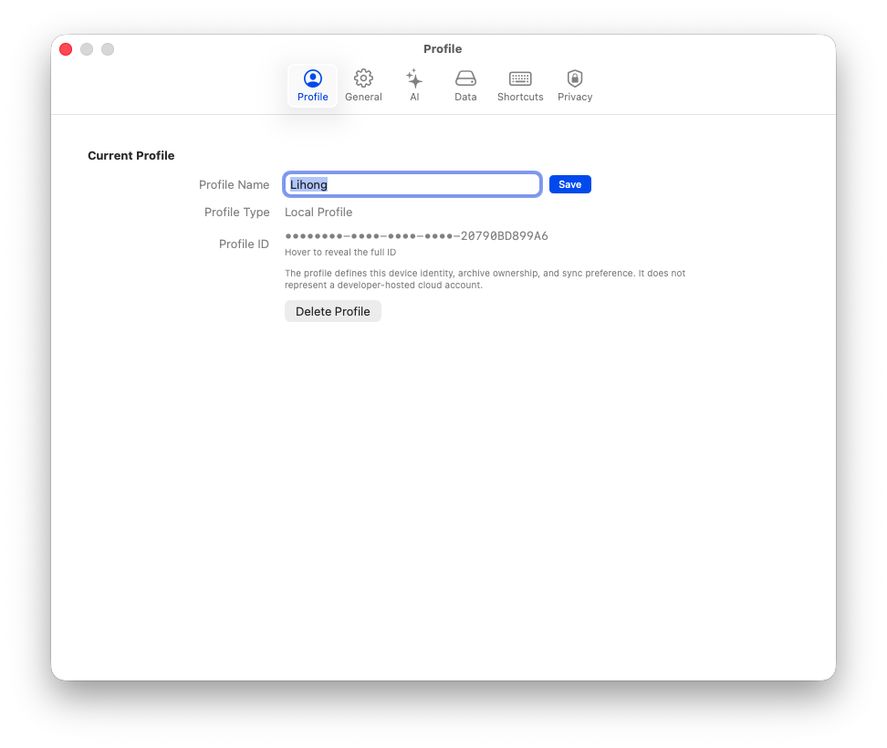
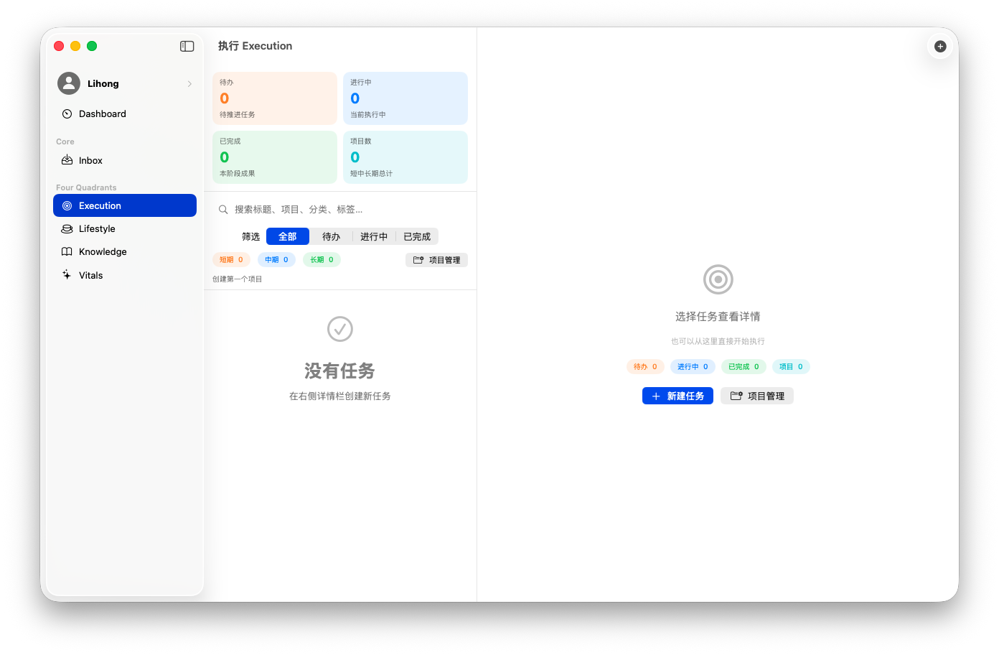
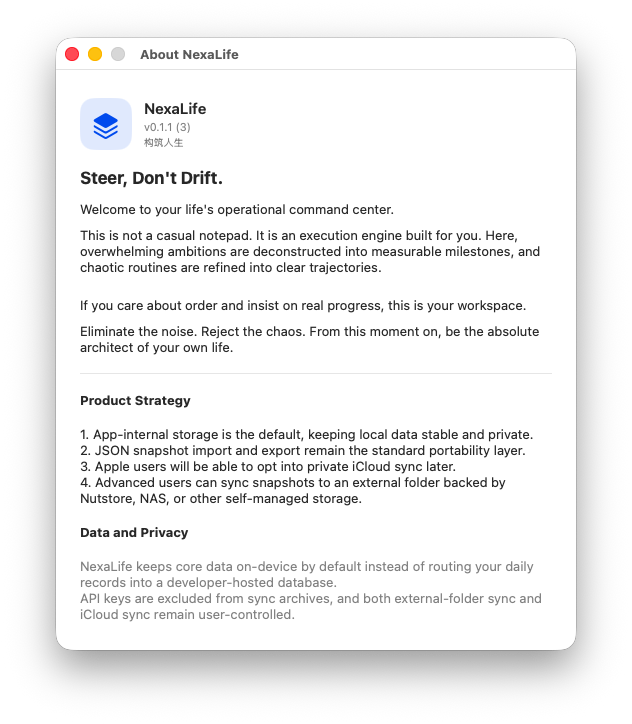

# NexaLife v0.1.1

`构筑人生 / NexaLife` 的首个命名统一版本。这个版本完成了品牌收敛、`Profile` 身份模型重命名，以及本地优先数据策略的对外说明补全。

## 中文发布说明

### 版本亮点

- 正式统一品牌名为 `构筑人生 / NexaLife`
- 引导流程中的“账户”语义整体收敛为 `Profile`
- 新增邮箱验证码流程，为邮箱 Profile 的创建与再次登录预留入口
- Settings 新增独立的 `Profile` 标签页
- About 窗口补全卷首语、产品策略与数据隐私说明
- Data 页同步模式明确为 `本机 / iCloud / 外部目录`
- 修复 Settings、Profile 详情与 About 等多处中英文切换不同步问题

### 截图预览

| Profile 引导 | Profile 设置 |
| --- | --- |
|  |  |

| 执行模块 | About 窗口 |
| --- | --- |
|  |  |

### 对已有用户的影响

- `Account` 相关文案现在统一改为 `Profile`
- 同步模式的表达从旧描述收敛为 `本机 / iCloud / 外部目录`
- 当前跨设备或跨版本迁移仍建议使用 JSON 快照导入导出

### 数据策略

- 默认仍采用 App 内部存储，优先保证本地稳定性与隐私
- JSON 快照导入导出是标准迁移层
- 不引入开发者托管云数据库
- 后续 iCloud 路线是进入用户自己的 Apple 私有容器
- 外部目录同步面向坚果云、NAS、iCloud Drive 等用户自管存储
- API Key 保存在 Keychain，不会进入同步快照

### 已知限制

- Apple Profile / iCloud 相关能力仍处于开发中，当前归档构建未开放正式同步链路
- 邮箱验证码流程已完成客户端形态，真实邮件发送仍需接入用户自有服务端接口
- 当前版本仍是早期 macOS 构建，推荐优先通过打包好的 release 体验

### 建议发布资产

- `NexaLife-macos-v0.1.1.zip`
- GitHub 自动生成的 Source code (`zip` / `tar.gz`)
- 如需校验文件完整性，可额外附带 `SHA256SUMS.txt`

## English Release Summary

### Highlights

- Finalized the public product name as `NexaLife / 构筑人生`
- Reframed identity terminology from `Account` to `Profile`
- Added an email verification flow for creating or re-entering an email profile
- Added a dedicated `Profile` tab in Settings
- Added the About window manifesto, strategy, and privacy copy
- Simplified sync choices to `Local / iCloud / External Folder`
- Fixed multiple localization refresh issues across profile-related views

### Screenshot Preview

| Onboarding | Profile settings |
| --- | --- |
|  |  |

| Execution | About |
| --- | --- |
|  |  |

### Upgrade Notes

- User-facing copy now consistently uses `Profile` instead of `Account`
- Sync mode wording is now standardized as `Local / iCloud / External Folder`
- JSON archive import/export remains the recommended migration path between builds or machines

### Data Strategy

- App-internal storage remains the default operating mode
- JSON snapshot import/export is the portability layer
- No developer-hosted cloud database is introduced
- Future iCloud sync is meant to stay inside the user's private Apple container
- External-folder sync is intended for user-managed storage such as Nutstore, NAS, or iCloud Drive
- API keys stay in Keychain and are excluded from sync archives

### Known Limits

- Apple profile and iCloud sync are still in development and are not enabled as a finished sync path in this archived build
- The email verification UI is ready, but real email delivery still requires a user-owned backend endpoint
- This is still an early macOS release, so the packaged build is the recommended way to evaluate `v0.1.1`

### Suggested Release Assets

- `NexaLife-macos-v0.1.1.zip`
- GitHub-generated source archives (`zip` / `tar.gz`)
- Optional `SHA256SUMS.txt` if you want to publish checksums
