# NexaLife

[English](README.md) | [简体中文](README.zh-CN.md)

[](https://github.com/Epiphany-Leon/NexaLife/releases)
[](https://www.gnu.org/licenses/gpl-3.0)

**Steer, Don't Drift.**

NexaLife (`构筑人生`) is a local-first SwiftUI life operating system for macOS. One durable workspace for capture, execution, knowledge, lifestyle records, and reflective review — with optional AI assistance woven through every module.

[Download v0.2.0](https://github.com/Epiphany-Leon/NexaLife/releases/tag/v0.2.0) | [Release Notes](Docs/release/v0.2.0/v0.2.0-release-notes.md)

---

## Install

### Homebrew (recommended)

```bash
brew tap Epiphany-Leon/nexalife
brew install --cask nexalife
```

### Manual download

Download `NexaLife-macos-v0.2.0.zip` from [Releases](https://github.com/Epiphany-Leon/NexaLife/releases), unzip, and move `NexaLife.app` to `/Applications`.

> **Requires macOS 26 Tahoe or later.**

### "App cannot be opened" on macOS 26

NexaLife is signed for personal distribution rather than through the Apple Developer Program, so macOS 26 may block the first launch. Pick whichever workaround fits you:

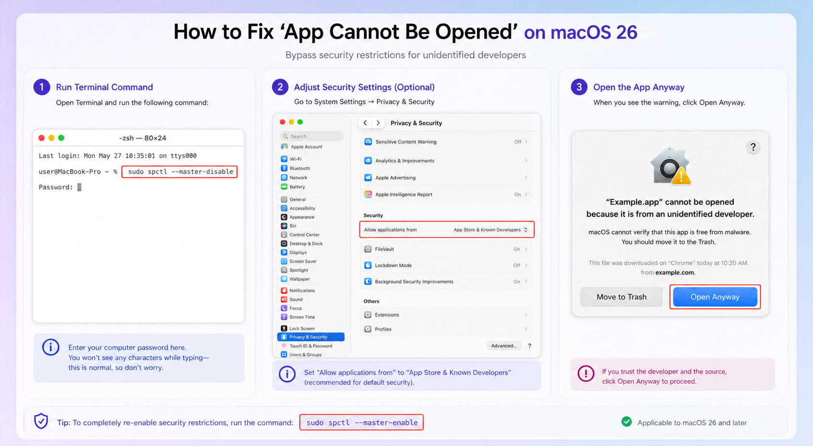

---

## Product Tour

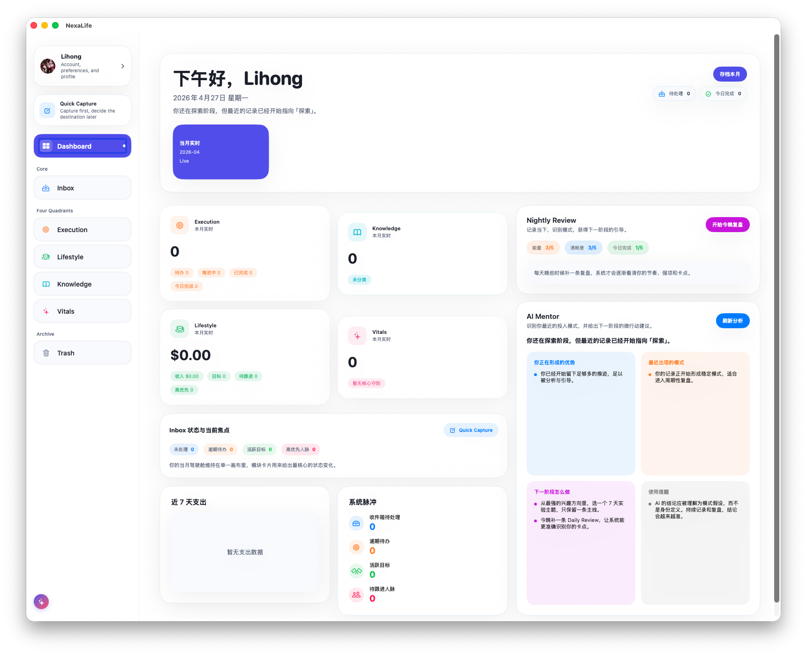

| Onboarding | AI Mentor Setup |
| --- | --- |
| 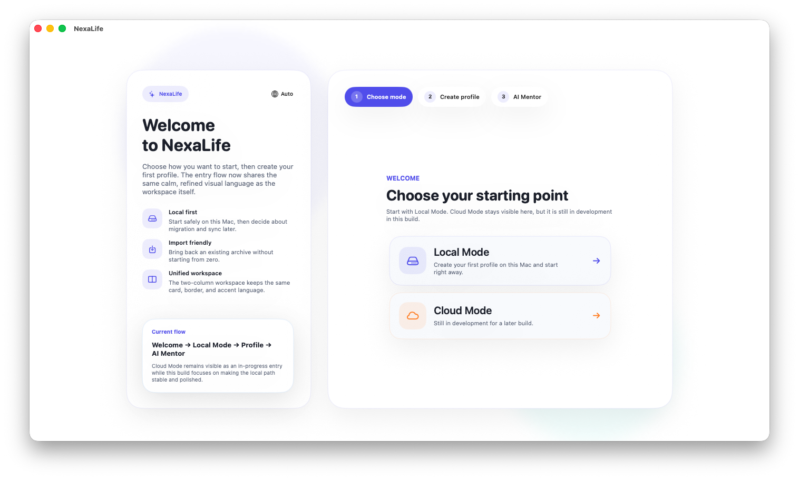 | 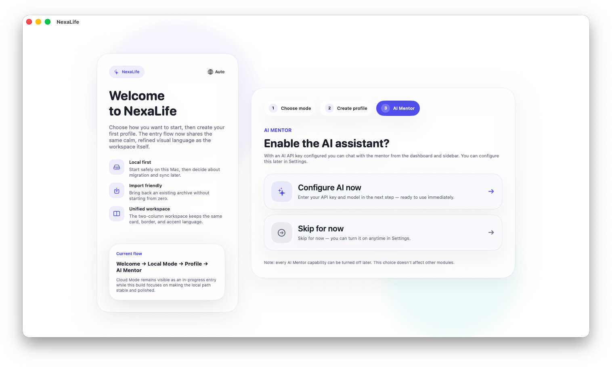 |

| Inbox | Quick Capture with AI routing |
| --- | --- |
| 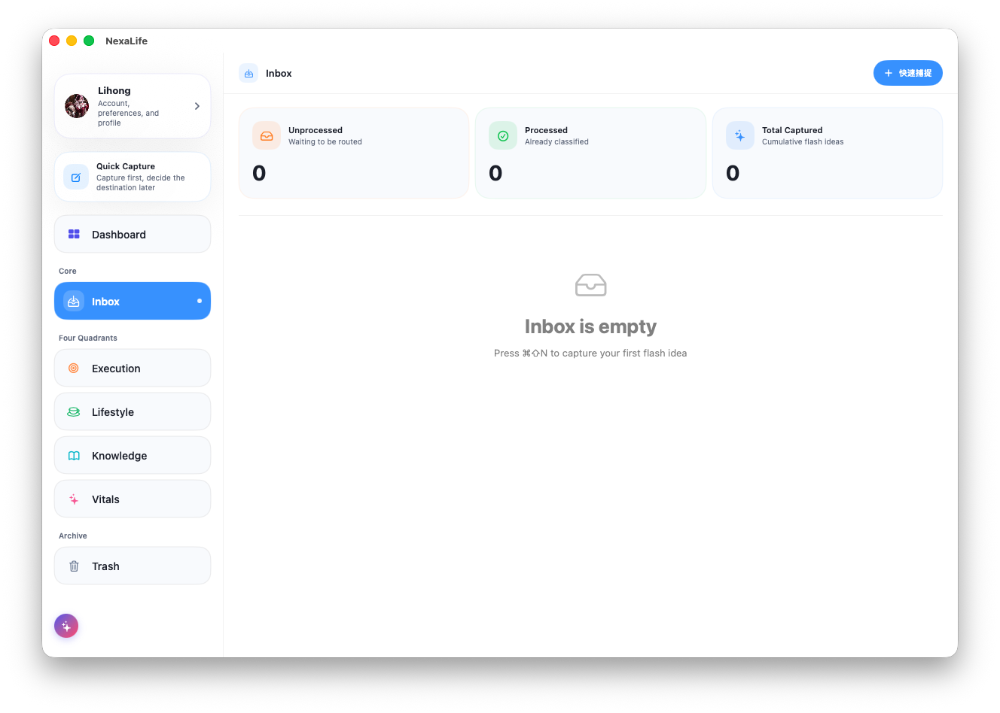 | 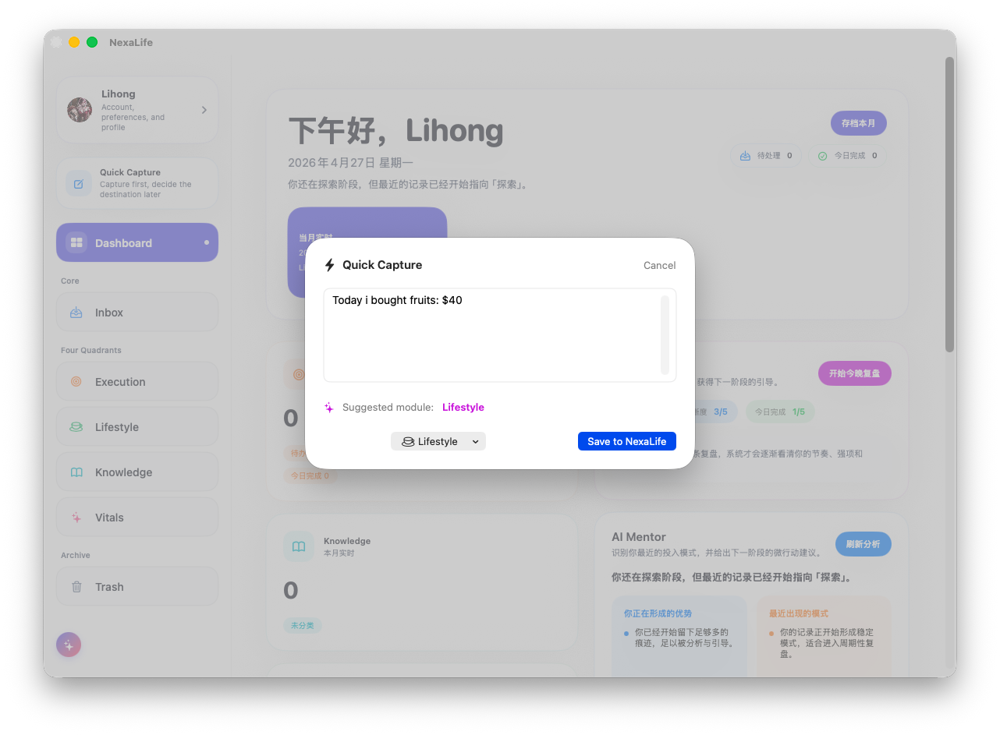 |

| Execution — Kanban & Projects | Knowledge |
| --- | --- |
| 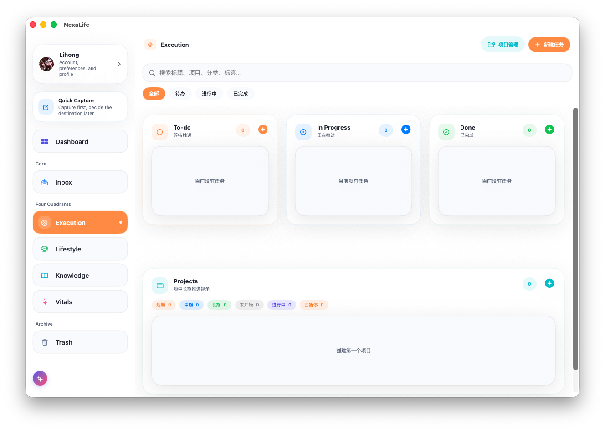 | 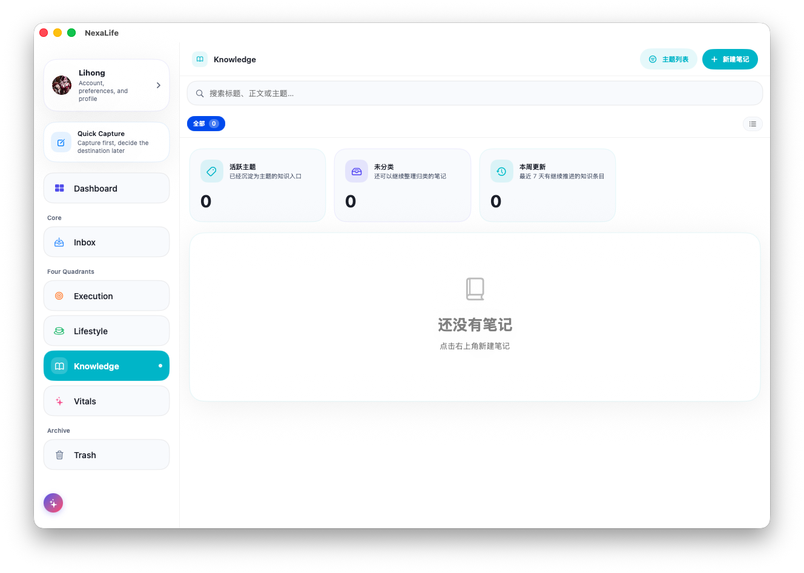 |

| Lifestyle — Ledger | Lifestyle — Goals |
| --- | --- |
| 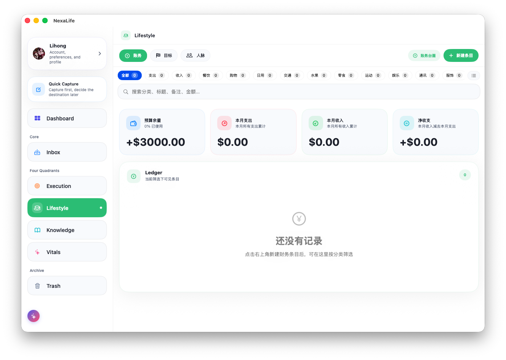 | 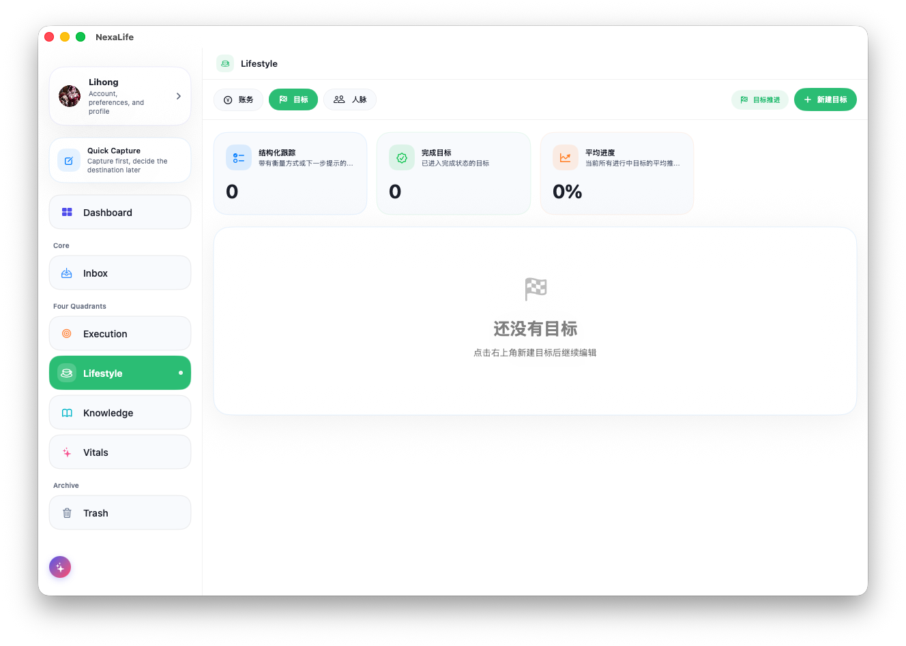 |

| Lifestyle — Connections | Vitals |
| --- | --- |
| 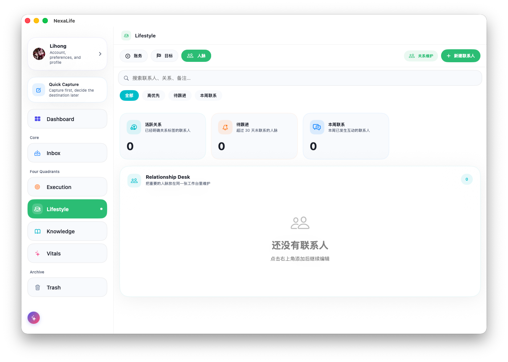 | 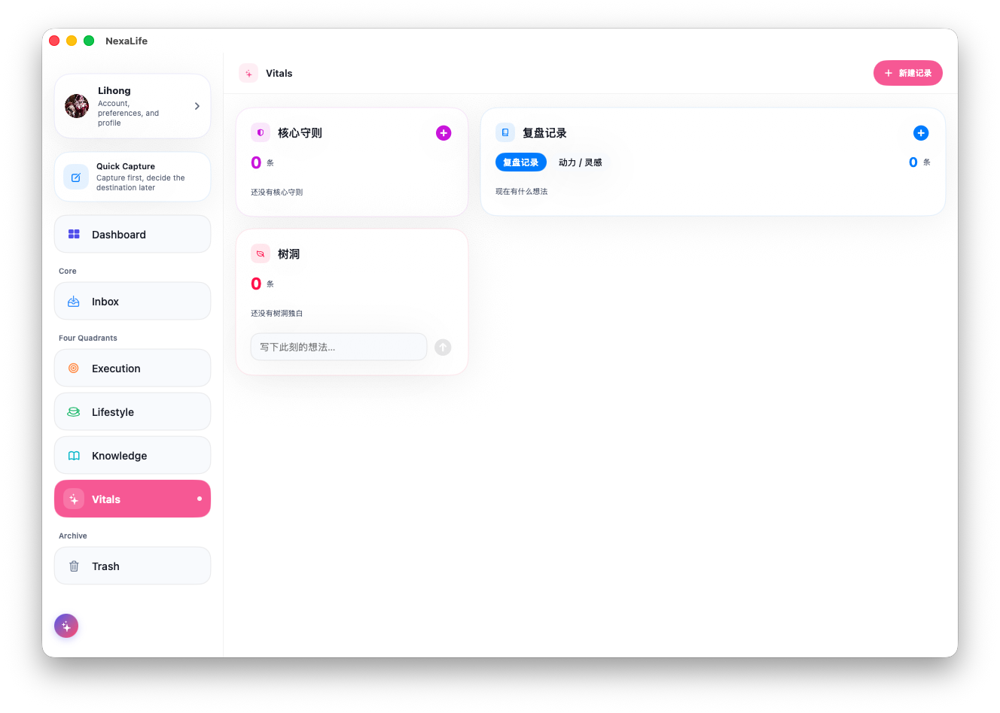 |

| AI Mentor Chat | About |
| --- | --- |
| 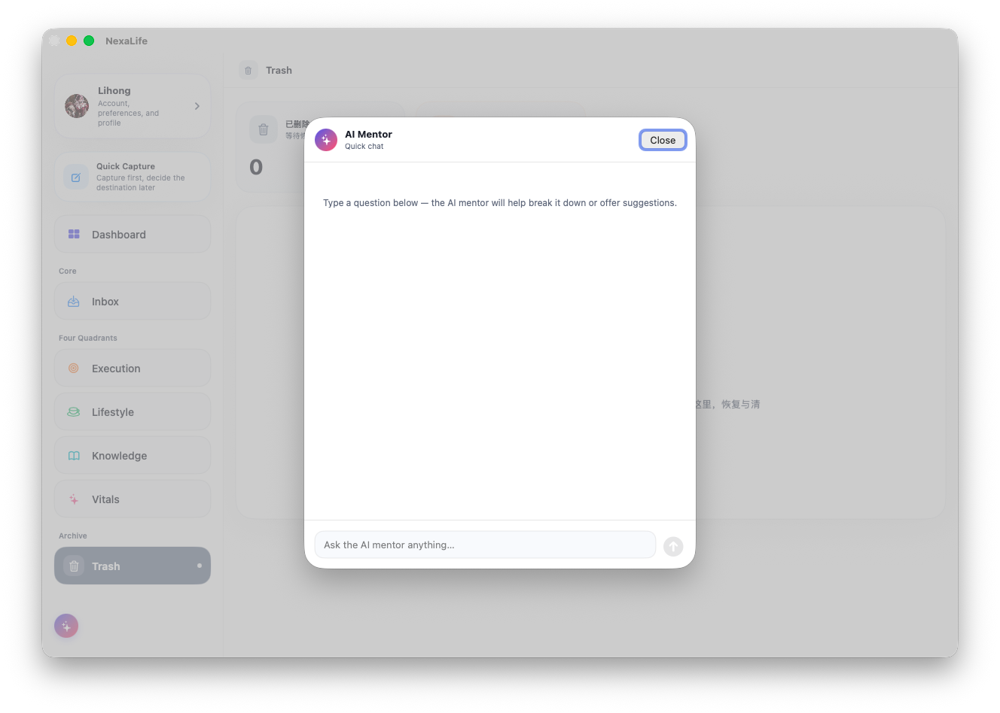 | 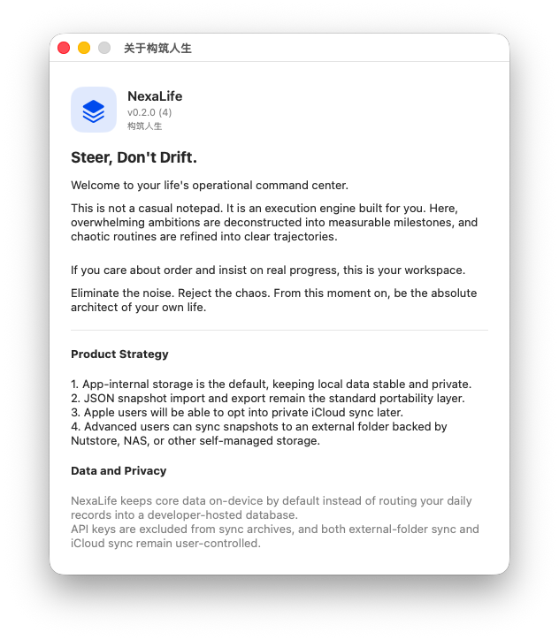 |

---

## Why NexaLife

- **One workspace** for capture, routing, execution, review, and long-term records — stop context-switching between five apps.
- **Local-first by default** — your daily data does not start in a developer-hosted cloud database.
- **AI is optional and gracefully falls back** to a local rule engine when no API key is configured.
- Structured around real personal operations: tasks, projects, finances, goals, notes, relationships, and self-review.

---

## Core Modules

| Module | Purpose |
|--------|---------|
| **Inbox** | Capture thoughts with Quick Capture (`⌘⌥N`), route them later. AI suggests the right module in real time. |
| **Execution** | Kanban board (To-do / In Progress / Done) + Projects panel with horizon and status tags. AI infers task category, tags, and project. |
| **Lifestyle** | Ledger with AI category suggestions, goal tracking, and relationship records with AI interaction strategy. |
| **Knowledge** | Notes organised by topic. AI can generate a summary report for any note. |
| **Vitals** | Core principles, mood and reflection logs, and a quick-capture Treehouse panel. |
| **Dashboard** | Monthly overview with AI Mentor guidance, daily review editor, and archive snapshots. |

---

## AI Integration

NexaLife integrates AI as a **contextual assistant**, not a chatbot wrapper:

- **Smart routing** — Quick Capture classifies new entries into the right module automatically.
- **Task metadata** — category, tags, and project name are inferred from the task title and notes.
- **Financial categorisation** — AI reads the transaction title and notes to suggest the right expense or income category.
- **Relationship insights** — importance scoring, interaction strategy, and next-action suggestion for each connection.
- **Dashboard guidance** — pattern recognition and weekly nudges based on your recent records.
- **AI Mentor chat** — a floating chat window accessible from any screen via the sidebar button.

**Providers supported:** DeepSeek (v4-flash, v4-pro, deepseek-chat, deepseek-reasoner) and Qwen. Custom providers can be added in the model picker (Settings → AI).

**No API key?** Every AI feature falls back to a local rule engine — the app is fully usable offline.

---

## Local-First Data Model

- App-internal SwiftData storage is the default working state.
- JSON snapshot export and import are the standard migration path across devices and builds.
- `External Folder` sync supports Nutstore, NAS, or iCloud Drive.
- Future `iCloud` sync will use the user's private Apple container, not a developer database.
- API keys are stored as a local file and excluded from sync archives.

---

## What's New in v0.2.0

- **AI woven throughout every module** — financial categorisation, task metadata, relationship insights, dashboard guidance, and always-visible AI Mentor chat.
- **Quick Capture AI routing fixed** — correctly suggests Lifestyle for spending-related captures; local keyword engine covers subscription, membership, fee, 扣费, 会员, and more.
- **Execution project rows redesigned** — coloured horizon and status tags on the left; edit/delete on the right; new "Paused" project status.
- **Task detail project field** upgraded to a combobox (type a new name or pick from existing projects).
- **Cherry Studio-style model picker** with custom provider support.
- **Onboarding** now includes an AI Mentor setup step.
- App bundle reduced from ~30 MB to ~1.9 MB (Docs moved out of bundle).
- CodeSign failure permanently fixed via Build Phase xattr-clear script.

[Full release notes →](Docs/release/v0.2.0/v0.2.0-release-notes.md)

---

## Current Scope

- NexaLife is an early macOS release built in SwiftUI targeting macOS 26 Tahoe.
- iCloud sync and external folder watch mode are planned for v0.4.0.
- Email verification UI is present; real email delivery requires a user-owned backend.
- JSON archive export/import is the reliable migration path between builds today.

---

## License

This project is licensed under **GNU GPL v3.0**. See [LICENSE](LICENSE).
