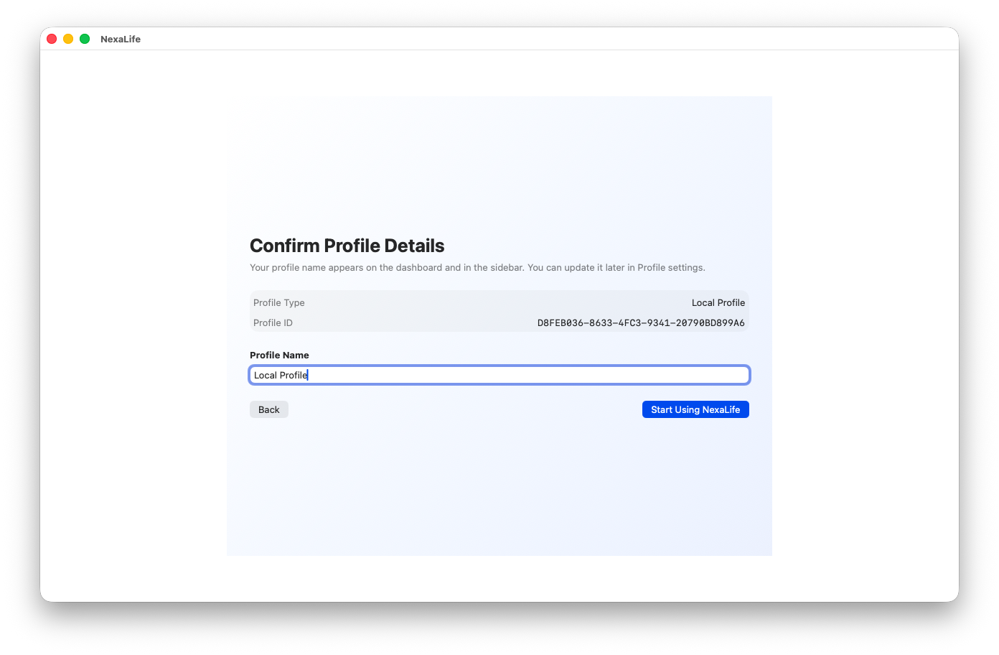

# NexaLife

[English](README.md) | [简体中文](README.zh-CN.md)

[](https://github.com/Epiphany-Leon/NexaLife/releases)
[](https://www.gnu.org/licenses/gpl-3.0)

**Steer, Don't Drift.**

NexaLife (`构筑人生`) is a local-first SwiftUI life operating system for people who want one durable workspace for capture, execution, knowledge, lifestyle records, and reflective review. It is built around a simple premise: your daily system should help you steer your life, not scatter it across separate apps.

`v0.1.1` is the first release that fully aligns the product name, the `Profile` identity model, and the app's privacy stance around on-device ownership.

[Download the latest macOS build](https://github.com/Epiphany-Leon/NexaLife/releases) | [Read the v0.1.1 release notes](NexaLife/Docs/release/v0.1.1/v0.1.1-release-notes.md)

## Product Tour


| Onboarding | Email profile confirmation |
| --- | --- |
|  |  |

| Profile settings | About window |
| --- | --- |
|  |  |

## Why NexaLife

- One workspace for capture, routing, execution, review, and long-term records.
- Local-first by default, so your daily data does not start in a developer-hosted cloud database.
- Structured around real personal operations: tasks, finances, goals, notes, relationships, and self-review.
- AI stays optional and falls back to local rules when no API key is configured.

## Core Areas

- `Inbox`: capture thoughts quickly, then route them later.
- `Execution`: manage tasks, projects, status, and active delivery work.
- `Lifestyle`: track ledger entries, goals, and relationship records.
- `Knowledge`: keep notes, topics, and reusable reference material together.
- `Vitals`: record core principles, mood, reflection, and self-observation.
- `Dashboard`: review the current month in one place and archive snapshots over time.

## Local-First Data Model

- App-internal storage remains the default working state.
- JSON snapshot export and import are the standard migration layer across devices and builds.
- `External Folder` sync is designed for user-managed storage such as Nutstore, NAS, or iCloud Drive.
- Future `iCloud` sync is intended to use the user's private Apple container rather than a developer database.
- API keys are stored in Keychain and excluded from sync archives.

## Optional AI Assistance

- Inbox routing suggestions can classify new captures into the most likely module.
- Execution metadata suggestions can infer categories, tags, and likely project names.
- Relationship records can generate optional AI insights, while local rules remain available as fallback.
- Provider settings currently support `DeepSeek` and `Qwen`.

## What's New in v0.1.1

- Unified the product identity as `NexaLife / 构筑人生`.
- Reframed `Account` into `Profile` throughout onboarding and Settings.
- Added an email verification flow for creating or re-entering an email profile.
- Added a dedicated `Profile` tab in Settings.
- Added a proper About window with manifesto, strategy, and privacy copy.
- Clarified sync modes as `Local / iCloud / External Folder`.
- Fixed multiple localization refresh problems across profile-related views.

## Current Scope

- NexaLife is currently an early macOS release built in SwiftUI.
- The archived `v0.1.1` build includes the Apple profile and iCloud path as product direction, but not as a finished sync feature.
- The email verification UI flow is present, but real email delivery still requires a user-owned backend endpoint.
- Today, JSON archive export/import is the reliable migration path between builds or machines.

## Download

For packaged builds, open [Releases](https://github.com/Epiphany-Leon/NexaLife/releases) and download the latest macOS asset, such as `NexaLife-macos-v0.1.1.zip`.

If you only want to try `v0.1.1`, the packaged release is the intended entry point.

## Run From Source

```bash
git clone git@github.com:Epiphany-Leon/NexaLife.git
cd NexaLife
open NexaLife.xcodeproj
```

Then select the `NexaLife` scheme in Xcode and run it with a compatible macOS/Xcode toolchain.

## Repository Layout

- `NexaLife/`: app source, assets, localized strings, and internal docs
- `NexaLife.xcodeproj/`: Xcode project
- `NexaLife/Docs/release/`: release notes and product screenshots
- `NexaLife/Docs/同步方案/`: sync, account, and archive design notes
- `NexaLife/Docs/开发日志/`: development logs

## License

This project is licensed under **GNU GPL v3.0**. See [LICENSE](LICENSE).
