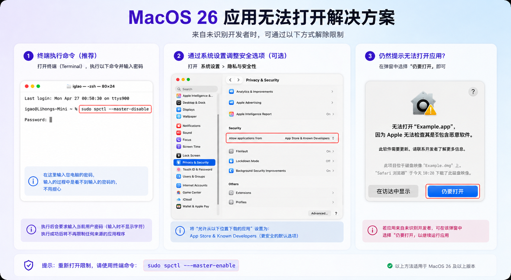

# 构筑人生 NexaLife

[English](README.md) | [简体中文](README.zh-CN.md)

[](https://github.com/Epiphany-Leon/NexaLife/releases)
[](https://www.gnu.org/licenses/gpl-3.0)

**掌控，而非漂流。**

构筑人生（`NexaLife`）是一款基于 SwiftUI 的 macOS 本地优先个人运行中枢——把收件、执行、知识、生活记录与觉知追踪放进同一个长期工作台，并在每个模块中提供可选的 AI 辅助。

[下载 v0.2.0](https://github.com/Epiphany-Leon/NexaLife/releases/tag/v0.2.0) | [查看发布说明](Docs/release/v0.2.0/v0.2.0-release-notes.md)

---

## 安装

### Homebrew（推荐）

```bash
brew tap Epiphany-Leon/nexalife
brew install --cask nexalife
```

### 手动下载

从 [Releases](https://github.com/Epiphany-Leon/NexaLife/releases) 下载 `NexaLife-macos-v0.2.0.zip`，解压后将 `NexaLife.app` 移入 `/Applications`。

> **需要 macOS 26 Tahoe 或更高版本。**

### macOS 26 "应用无法打开" 解决方案

NexaLife 采用个人分发签名（非 Apple Developer Program 公证），macOS 26 可能拦截首次启动。下面三种方式任选其一即可：



---

## 产品截图


| 引导流程 | AI Mentor 配置 |
| --- | --- |
|  |  |

| 收件箱 | 快速捕捉（AI 模块路由） |
| --- | --- |
|  |  |

| 执行 — 看板 & 项目 | 知识 |
| --- | --- |
|  |  |

| 生活 — 账务 | 生活 — 目标 |
| --- | --- |
|  |  |

| 生活 — 人脉 | 觉知 |
| --- | --- |
|  |  |

| AI Mentor 对话 | 关于窗口 |
| --- | --- |
|  |  |

---

## 为什么是构筑人生

- **一个统一工作台**，承接"想到 → 收进来 → 分流 → 执行 → 复盘 → 沉淀"这条完整链路，不再依赖五个分散的工具。
- **默认本地优先**，不把你的日常数据先放进开发者托管云数据库。
- **AI 只是可选加速器**，没有配置 API Key 时自动回退到本地规则引擎，应用可完全离线使用。
- 同时覆盖任务、项目、账务、目标、人脉、笔记、觉知，不再拆散成多个系统。

---

## 核心模块

| 模块 | 用途 |
|------|------|
| **收件箱 Inbox** | 用快速捕捉（`⌘⌥N`）先记下想法，AI 实时建议归属模块，之后再决定如何处理。 |
| **执行 Execution** | 看板（待办 / 进行中 / 已完成）+ 项目面板（含时间跨度和状态标签），AI 推断任务分类、标签和项目。 |
| **生活 Lifestyle** | 账务记录（AI 分类建议）、目标追踪、人脉管理（AI 互动策略）。 |
| **知识 Knowledge** | 按主题组织笔记，AI 可为任意笔记生成摘要报告。 |
| **觉知 Vitals** | 核心守则、情绪与反思日志，以及快速记录的"树洞"面板。 |
| **仪表盘 Dashboard** | 月度概览、AI Mentor 引导面板、每日复盘编辑器、归档快照。 |

---

## AI 集成

构筑人生将 AI 作为**情境助手**融入工作流，而非简单的聊天包装：

- **智能路由** — 快速捕捉自动将新条目分流到最匹配的模块。
- **任务元数据** — 从标题和备注推断分类、标签和所属项目。
- **财务分类** — AI 读取交易标题与备注，建议最匹配的支出或收入分类。
- **人脉洞察** — 为每个联系人生成重要性评分、互动策略和下一步行动建议。
- **仪表盘引导** — 基于近期记录的模式识别与周期性建议。
- **AI Mentor 对话** — 侧边栏浮球随时可用，从任意界面一键打开对话窗口。

**支持的提供商：** DeepSeek（v4-flash、v4-pro、deepseek-chat、deepseek-reasoner）和通义千问。可在 设置 → AI 的模型选择器中添加自定义提供商。

**没有 API Key？** 每个 AI 功能都有本地规则引擎兜底，应用可完全离线使用。

---

## 数据与同步策略

- 默认工作形态是 App 内部 SwiftData 存储，优先保证本地稳定性。
- 标准迁移层是 JSON 快照导入导出，适合换版本或换设备。
- `外部目录` 模式面向坚果云、NAS、iCloud Drive 等用户自管目录。
- 后续 `iCloud` 路线是进入用户自己的 Apple 私有容器，而不是开发者托管数据库。
- API Key 以本地文件形式存储，不进入同步快照。

---

## v0.2.0 新增内容

- **AI 贯穿全模块** — 财务分类建议、任务元数据推断、人脉洞察、仪表盘引导、始终可见的 AI Mentor 对话。
- **Quick Capture AI 路由修复** — 消费类内容正确建议 Lifestyle；本地关键词引擎新增 subscription、membership、fee、扣费、会员等 15 个词条。
- **执行模块项目行重构** — 左侧彩色时间跨度 & 状态标签，右侧编辑/删除操作，新增"已暂停"项目状态。
- **任务详情项目字段**升级为 Combobox（可输入新名称或从现有项目下拉选择）。
- **Cherry Studio 风格模型选择器**，支持自定义提供商。
- **Onboarding 新增 AI Mentor 配置步骤**。
- App bundle 从 ~30 MB 缩减至 ~1.9 MB（Docs 移出 bundle）。
- Xcode 构建 CodeSign 失败彻底修复。

[完整发布说明 →](Docs/release/v0.2.0/v0.2.0-release-notes.md)

---

## 当前范围说明

- 构筑人生目前是面向 macOS 26 Tahoe 的早期 SwiftUI 版本。
- iCloud 同步与外部目录监听模式计划在 v0.4.0 中实现。
- 邮箱验证 UI 已就位，真实发信能力需要用户自建服务端。
- 目前换版本/换设备的可靠迁移路径是 JSON 快照导入导出。

---

## 许可证

本项目采用 **GNU GPL v3.0**，详见 [LICENSE](LICENSE)。
