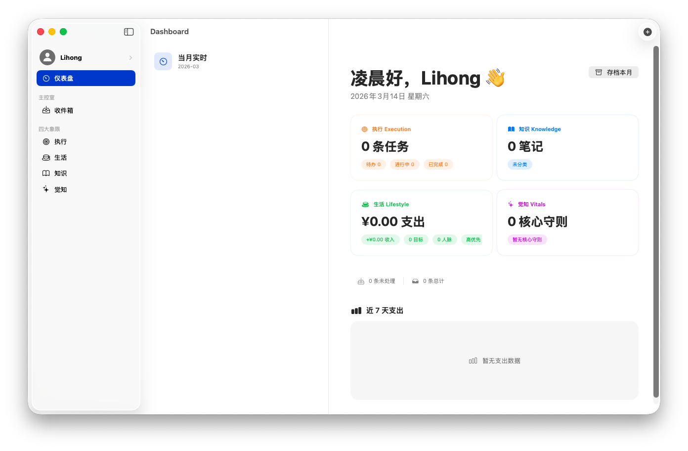
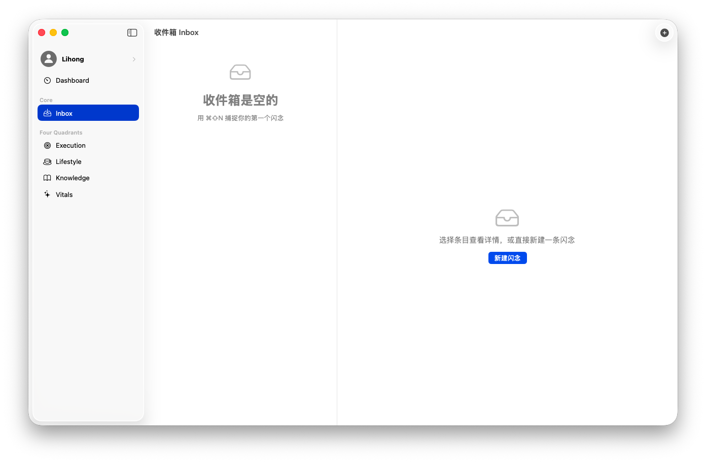
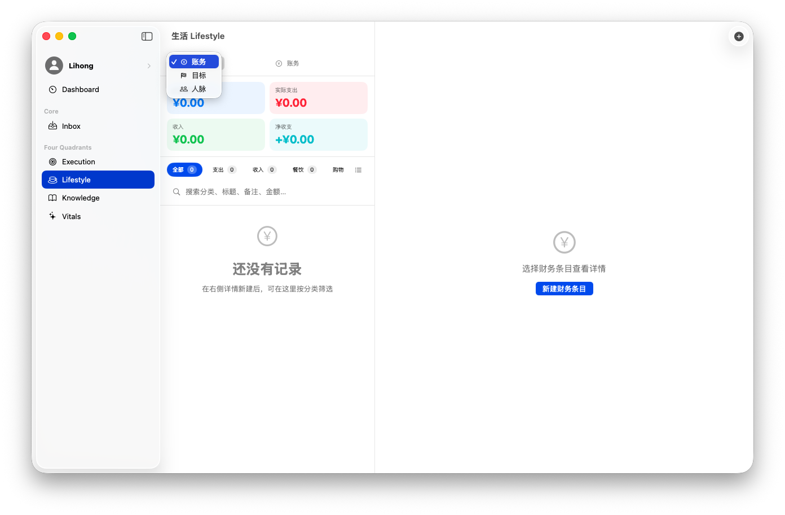
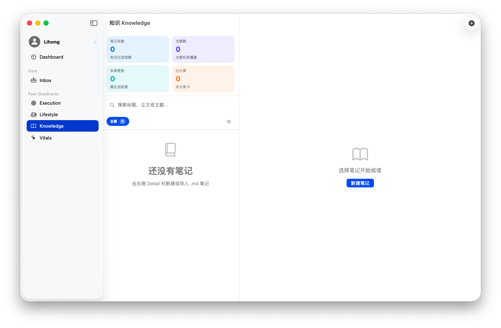
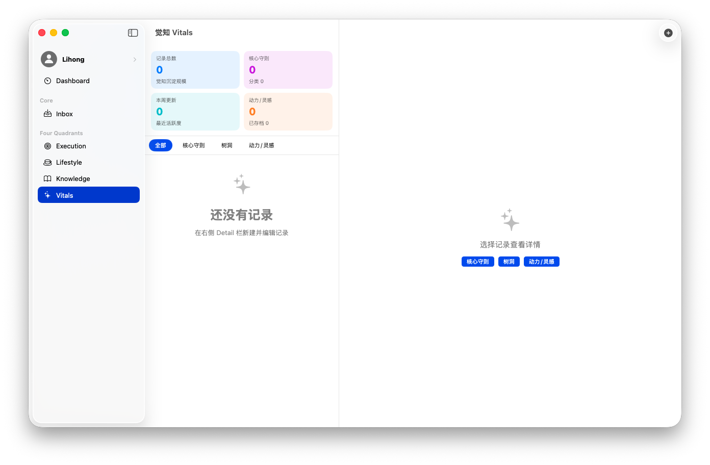
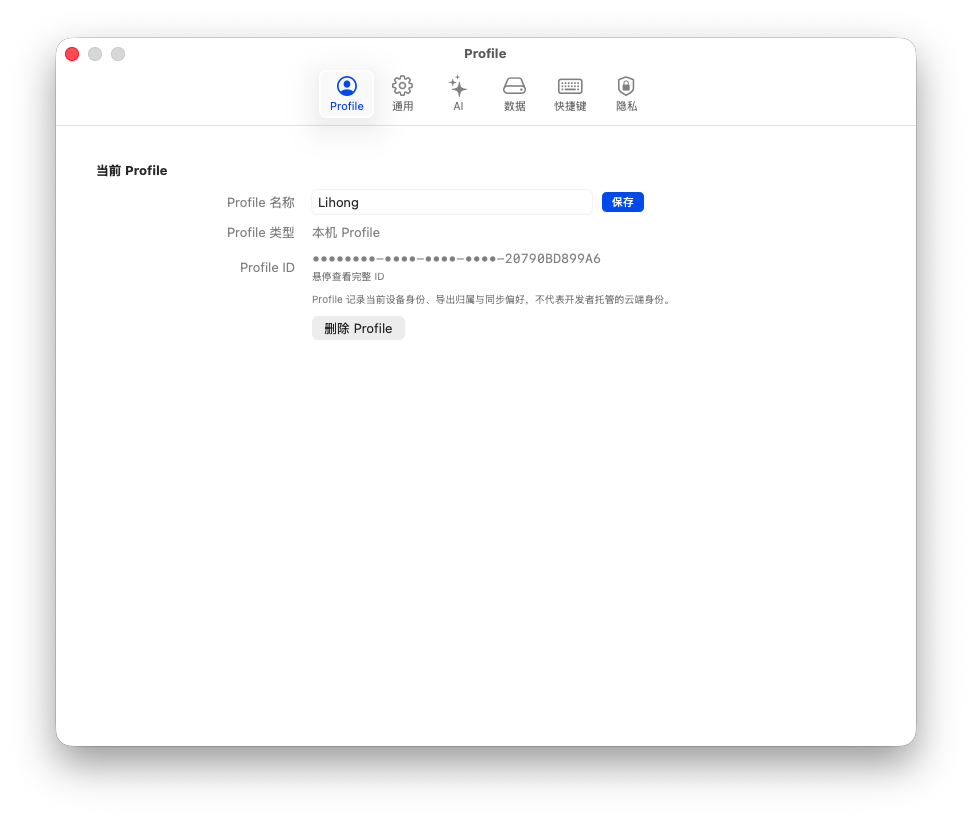
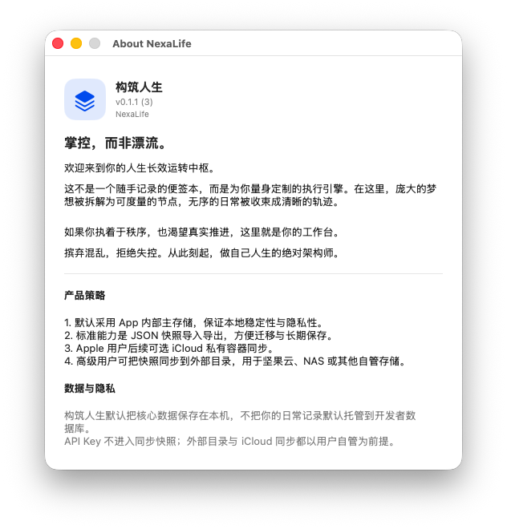

# 构筑人生 NexaLife

[English](README.md) | [简体中文](README.zh-CN.md)

[](https://github.com/Epiphany-Leon/NexaLife/releases)
[](https://www.gnu.org/licenses/gpl-3.0)

**掌控，而非漂流。**

构筑人生（`NexaLife`）是一款基于 SwiftUI 的本地优先个人运行中枢，用来把收件、执行、知识、生活记录与觉知追踪放进同一个长期工作台。它不是一个“再多一个工具”，而是希望成为你管理人生系统时的主界面。

`v0.1.1` 是第一个完成品牌统一、`Profile` 身份模型收敛、以及数据策略说明补全的版本。

[下载最新 macOS 构建](https://github.com/Epiphany-Leon/NexaLife/releases) | [查看 v0.1.1 发布说明](NexaLife/Docs/release/v0.1.1/v0.1.1-release-notes.md)

## 产品截图



| 收件箱 | 执行 |
| --- | --- |
|  |  |

| 生活 | 知识 |
| --- | --- |
|  |  |

| 觉知 | Profile |
| --- | --- |
|  |  |

### 关于窗口



## 为什么是构筑人生

- 用一个统一工作台承接“想到、收进来、分流、执行、复盘、沉淀”这条链路。
- 默认本地优先，不把你的日常数据先放进开发者托管云数据库。
- 同时覆盖任务、项目、账务、目标、人脉、笔记、觉知，不再拆散成多个系统。
- AI 只是可选加速器，没有配置 API Key 时仍可回退到本地规则。

## 当前覆盖的核心模块

- `收件箱 Inbox`：先快速捕捉，再决定归类与处理。
- `执行 Execution`：管理任务、项目、状态与推进节奏。
- `生活 Lifestyle`：记录账务、目标和关系网络。
- `知识 Knowledge`：沉淀笔记、主题与长期参考材料。
- `觉知 Vitals`：记录原则、状态、反思与自我观察。
- `仪表盘 Dashboard`：集中查看当月概览，并支持月度存档。

## 数据与同步策略

- 默认工作形态是 App 内部存储，优先保证本地稳定性。
- 标准迁移层是 JSON 快照导入导出，适合换版本或换设备。
- `外部目录` 模式面向坚果云、NAS、iCloud Drive 等用户自管目录。
- 后续 `iCloud` 路线是进入用户自己的 Apple 私有容器，而不是开发者托管数据库。
- API Key 默认存储在 Keychain，且不会进入同步快照。

## 可选 AI 能力

- 收件内容可做模块归类建议。
- 执行任务可推断分类、标签和可能的项目归属。
- 人脉记录可生成关系洞察；如果未配置密钥，会回退到本地规则。
- 当前设置页支持 `DeepSeek` 与 `Qwen` 两类提供方。

## v0.1.1 更新重点

- 正式统一品牌名为 `构筑人生 / NexaLife`。
- 将产品中的 `Account` 语义整体收敛为 `Profile`。
- 新增邮箱验证码流程，用于创建或进入邮箱 Profile。
- 在 Settings 中加入独立的 `Profile` 标签页。
- 新增 About 窗口，补齐卷首语、产品策略和隐私说明。
- 将同步模式明确为 `本机 / iCloud / 外部目录`。
- 修复多处中英文切换与 Profile 相关界面的刷新问题。

## 当前版本边界

- NexaLife 目前仍是一个早期的 macOS SwiftUI 版本。
- 归档的 `v0.1.1` 构建已经体现 Apple Profile 与 iCloud 路线，但还不是完整可用的正式同步能力。
- 邮箱验证码流程已具备客户端形态，但真实邮件发送仍需要你自己的服务端接口。
- 当前跨版本、跨设备迁移时，最稳妥的方式仍然是 JSON 快照导入导出。

## 下载方式

打开 [Releases](https://github.com/Epiphany-Leon/NexaLife/releases)，下载最新的 macOS 构建产物，例如 `NexaLife-macos-v0.1.1.zip`。

如果只是体验 `v0.1.1`，优先使用打包好的 release 版本。

## 从源码运行

```bash
git clone git@github.com:Epiphany-Leon/NexaLife.git
cd NexaLife
open NexaLife.xcodeproj
```

然后在 Xcode 中选择 `NexaLife` scheme，并使用兼容的 macOS / Xcode 工具链运行。

## 仓库结构

- `NexaLife/`：应用源码、资源、本地化和内部文档
- `NexaLife.xcodeproj/`：Xcode 工程
- `NexaLife/Docs/release/`：发布说明与产品截图
- `NexaLife/Docs/同步方案/`：同步、账户与归档设计文档
- `NexaLife/Docs/开发日志/`：开发日志

## 许可证

本项目采用 **GNU GPL v3.0**，详见 [LICENSE](LICENSE)。
